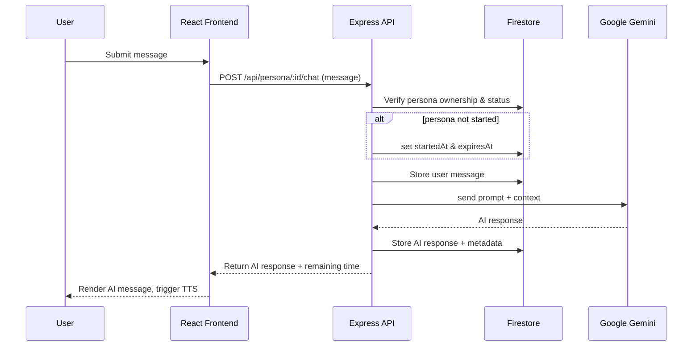
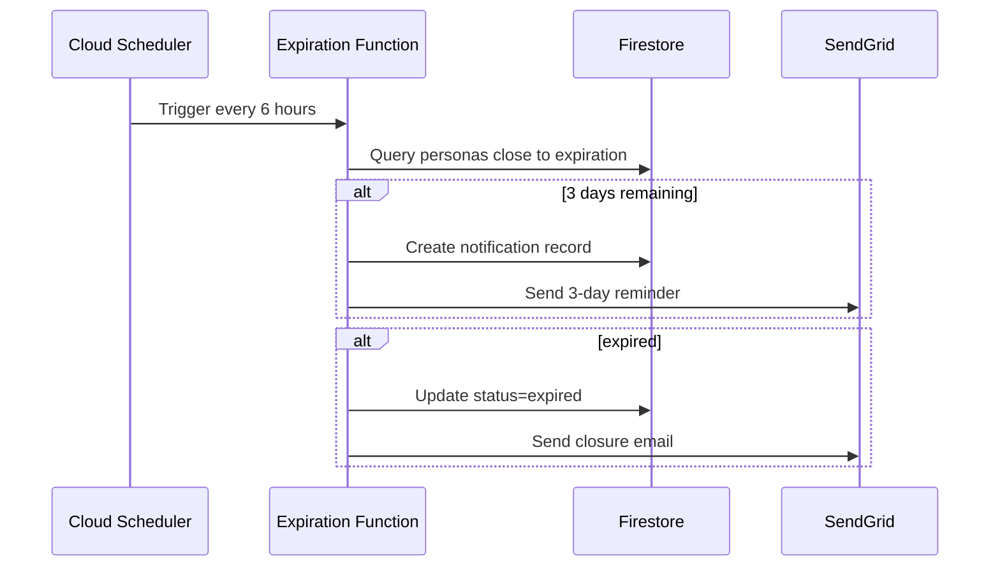
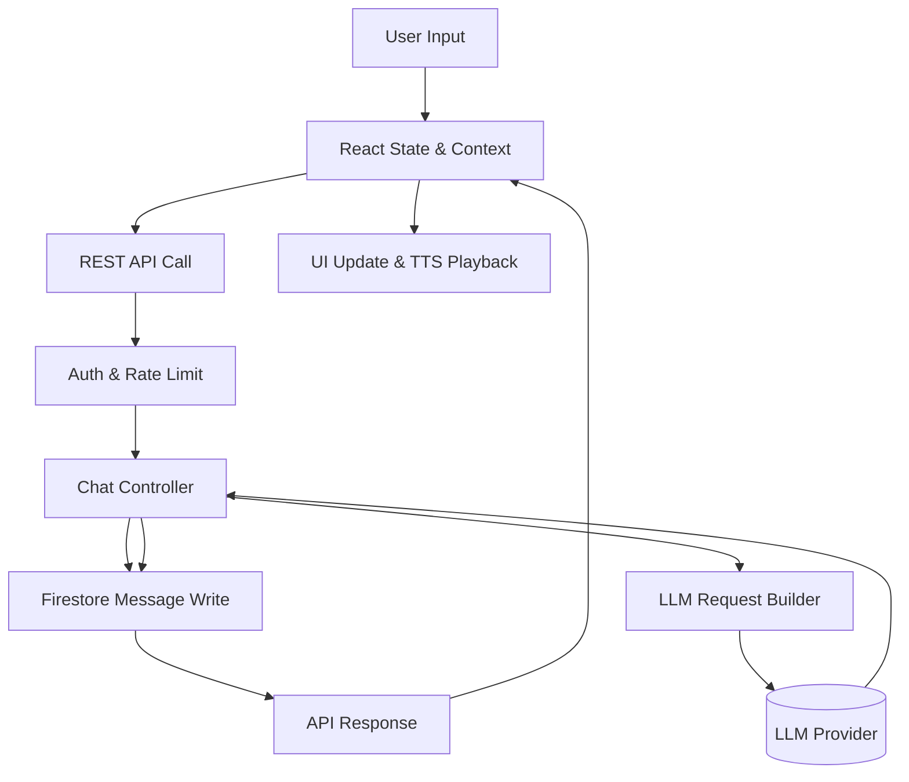

# Architecture Overview

## Component Diagram

```mermaid
flowchart LR
    subgraph Frontend [Frontend (Vercel)]
        UI[React App]
        Chat[PersonaChat Component]
        Dashboard[Dashboard Component]
    end

    subgraph Backend [Backend (Firebase Cloud Functions / Cloud Run)]
        API[Express API]
        AuthMiddleware[Firebase Auth Middleware]
        LLMService[LLM Service]
        Scheduler[Scheduled Jobs]
    end

    subgraph Firebase [Firebase Services]
        Firestore[(Firestore)]
        Auth[(Firebase Auth)]
        Storage[(Cloud Storage)]
    end

    subgraph External [External Services]
        Gemini[(Google AI Studio)]
        SendGrid[(Email Provider)]
    end

    UI --> Chat
    UI --> Dashboard
    Chat -->|REST| API
    Dashboard -->|REST| API
    API --> AuthMiddleware
    AuthMiddleware --> Firestore
    API --> LLMService --> Gemini
    API --> Firestore
    API --> Storage
    Scheduler --> Firestore
    Scheduler --> SendGrid
    Firestore --> Auth
```

## Sequence Diagram — Chat Flow



## Timer & Expiration Flow



## Data Flow



## Hosting & Deployment

- **Frontend**: Deployed on Vercel; environment variables injected via Vercel dashboard.
- **Backend**: Deployed as Firebase Cloud Functions (Express app wrapped with `functions.https.onRequest`) or containerized for Cloud Run.
- **Scheduler**: Firebase Scheduled Functions drive expiration and notification jobs.
- **Firestore**: Primary data store for users, personas, messages, notifications, audit logs.
